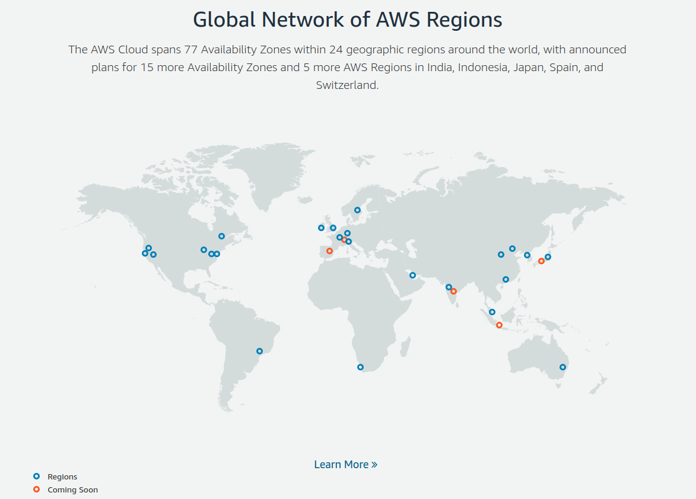
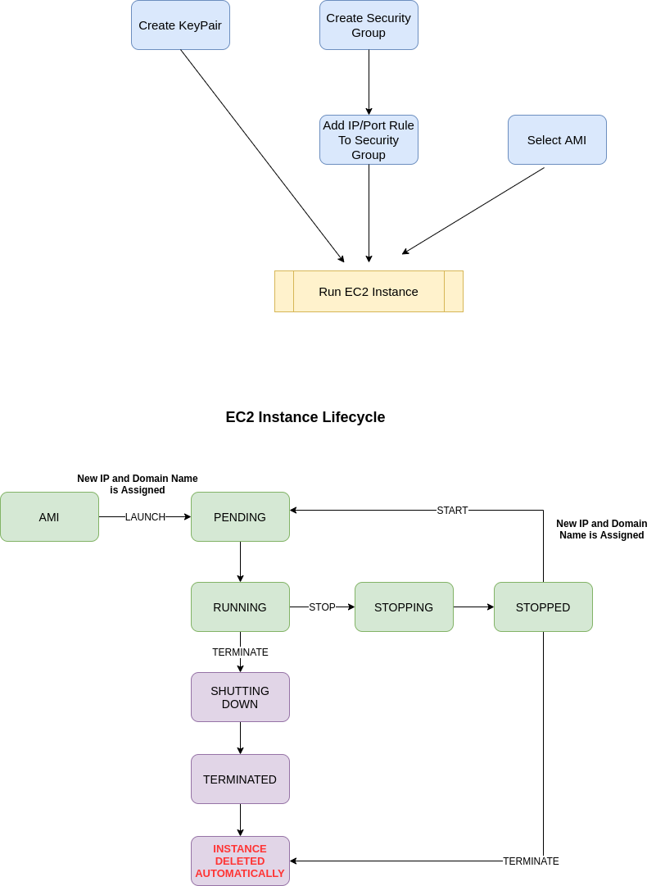

# Amazon Web Services

#### Content

AWS Nedir

Kayıt / [Fiyatlandırma](https://aws.amazon.com/free/?all-free-tier.sort-by=item.additionalFields.SortRank&all-free-tier.sort-order=asc) / Ödeme / Free Tier Kapsamı

[Price Calculator](https://calculator.aws/)

AWS Console

AWS Global Infrastructure

​		Regions, Availability Zones, Local Zones

AWS Identity and Access Management (IAM)

Amazon EC2

​		[Instance Type](https://aws.amazon.com/ec2/instance-types/)

​		Amazon Machine Images (AMI) 	

​			[Finding AMI](https://docs.aws.amazon.com/AWSEC2/latest/UserGuide/finding-an-ami.html)

​			Building AMI

​			[OnDemand Pricing](https://aws.amazon.com/ec2/pricing/on-demand/)

Amazon Virtual Private Cloud

Amazon API Gateway

Amazon Route 53

Elastic Load Balancing

Amazon S3

Amazon S3 Glacier

AWS CodeCommit - CodePipeline

Amazon EBS

Amazon DynamoDB 

​	[Read/Write Capacity Mode](https://docs.aws.amazon.com/amazondynamodb/latest/developerguide/HowItWorks.ReadWriteCapacityMode.html)

Amazon Elasticache

Amazon API Gateway

AWS Lambda

Amazon Lightsail

Amazon Elastic Kubernetes Service

AWS Fargate

Amazon Cognito

AWS Device Farm

AWS Amplify

Amazon GameLift

Amazon Polly

Amazon Lex

Amazon Rekognition

TensorFlow on AWS

AWS RoboMaker

AWS Ground Station

CloudCraft

Hands on Experience - Designing A Planet Scaled Application

https://docs.aws.amazon.com/AmazonRDS/latest/UserGuide/Concepts.RegionsAndAvailabilityZones.html

https://aws.amazon.com/about-aws/global-infrastructure/?p=ngi&loc=0

https://docs.aws.amazon.com/index.html

2020 Magic Quadrant for Cloud Infrastructure & Platform Services

https://pages.awscloud.com/GLOBAL-multi-DL-gartner-mq-cips-2020-learn.html

Sustainability in the Cloud

Amazon Web Services (AWS) is committed to running our business in the most environmentally friendly way possible and achieving 100% renewable energy usage for our global infrastructure.

EC2'ye ssh ile bağlanırken kullanılan pem dosyasının dosya hakları 400 olmalıdır.

